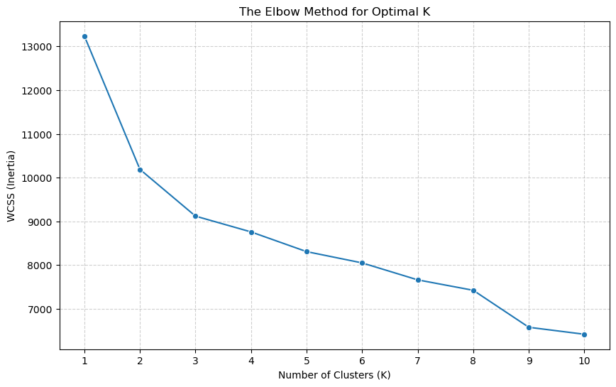

# Customer Personality Analysis & Segmentation

## 📌 Project Overview
The goal of this project is to perform an unsupervised clustering analysis on a company's customer base. By identifying mathematically distinct customer personas, the marketing team can pivot from a broad "spray and pray" campaign strategy to highly targeted, cost-efficient marketing.

## 🛠️ Tech Stack & Concepts
* **Languages & Libraries:** Python, Pandas, Scikit-Learn, Matplotlib, Seaborn
* **Preprocessing:** `ColumnTransformer`, `StandardScaler`, `OneHotEncoder`, `OrdinalEncoder`
* **Unsupervised Learning:** K-Means Clustering, The Elbow Method (WCSS)
* **Dimensionality Reduction:** t-SNE (t-distributed Stochastic Neighbor Embedding)

## 📊 The Approach
1. **Feature Engineering:** Created aggregated behavioral metrics (e.g., `Total_Spend`, `Total_Kids`, `Age` from birth year) to better capture household purchasing power.
2. **Robust Preprocessing:** Built a deployment-ready Scikit-Learn `ColumnTransformer` to scale continuous variables while preserving the geometric distance of One-Hot Encoded categorical variables. 
3. **Determining optimal K:** Plotted the inertia (WCSS) across 10 iterations to mathematically identify the 'elbow' at K=3.
4. **Dimensionality Reduction:** Applied t-SNE to project the 12-dimensional customer matrix into a 2D visual space, validating the density and separation of the K-Means clusters.

## 💡 Key Business Insights (The 3 Personas)
Based on the K-Means algorithm, the customer base naturally divides into three distinct tiers:

* **Segment 2 ("The Cash Cows"):** High-earning professionals ($76k) with no children. They have massive discretionary income and represent the highest average spend ($1,356). **Action:** Target with premium, high-margin products.
* **Segment 0 ("The Middle Class"):** Older families (Avg Age: 61) with a solid income ($57k). However, the presence of children (1.2 avg) acts as a hard cap on their discretionary spending ($747). **Action:** Target with family-oriented bundles and loyalty rewards.
* **Segment 1 ("The Budget Shoppers"):** Families strictly maximizing utility. They have the lowest income ($34k), the highest number of dependents, and barely spend capital with the brand ($91). **Action:** Exclude from expensive marketing campaigns; target only with deep-discount clearances.

## 📈 Visualizations
### 1. Identifying the Clusters (The Elbow Method)

### 2. Validating the Segments (t-SNE Projection)

